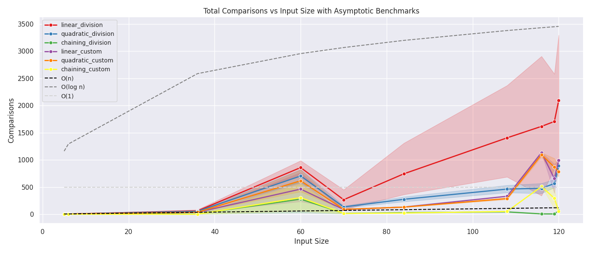

# kmerHashing

## 1. Overview
kmerHashing is a Java-based project that implements and analyzes multiple hashing strategies as part of a course assignment in Algorithms for Bioinformatics. The system supports both division hashing and Fibonacci hashing (Knuth’s method), each with linear probing, quadratic probing, and separate chaining.

Users can run one of 14 predefined hashing schemes or configure custom runs via command-line. The program tracks detailed performance metrics—including comparisons, collisions, probes, memory usage, and execution time—and outputs results in an analysis-ready format.



### 1.1 Java Version
#### Versioning

This project follows **semantic versioning** for version control. The current version is:

- **Version**: 1.0-SNAPSHOT

#### Development Environment

The project was developed and executed in the following environment:

- **Operating System**: Ubuntu on WSL2 (Windows Subsystem for Linux)
- **Java Version**: OpenJDK 17
- **Build Tool**: Maven 3.8.1
- **IDE**: IntelliJ IDEA Ultimate

### 1.2 Project Structure
```
kmerHashing/
├── src/main/java/edu/jhu/algos
│   ├── Main.java                  # CLI entry point
│   ├── HashingDriver.java        # Executes all schemes
│   ├── hashing/                  # Core hashing logic
│   │   ├── HashTable.java        # Abstract base
│   │   ├── DivisionHashTable.java
│   │   ├── CustomHashTable.java
│   │   ├── ProbingStrategy.java
│   │   ├── HashingScheme.java    # Scheme metadata
│   ├── data_structures/          # Chaining helpers
│   │   ├── ChainedNode.java
│   │   ├── LinkedListChain.java
│   │   └── Stack.java
│   ├── io/
│   │   ├── HashFileHandler.java
│   │   └── OutputFormatter.java
│   └── utils/
│       └── PerformanceMetrics.java
├── input/                        # Input .txt files
├── output/                       # Outputs, one per scheme/config
├── pom.xml                      # Maven build
```

---

---
## 2. How to Compile and Run

### Compile with Maven

To compile the project, use Maven to build the application:

```bash
mvn clean package
```

This command will clean the project, compile the source code, and create a runnable `.jar` file located in the `target/` directory.

### Run Predefined Scheme (1–14)

To run one of the predefined schemes (1–14), use the following command. Replace `<scheme_number>` with the desired scheme number (e.g., `3`):

```bash
java -jar target/Book_AJ_Lab2.jar \
  --scheme <scheme_number> \
  --input input/example.txt \
  --output output/scheme_<scheme_number>.txt \
  --debug
```

For example, to run **Scheme 3** (Division Hashing with linear probing), use:

```bash
java -jar target/Book_AJ_Lab2.jar \
  --scheme 3 \
  --input input/example.txt \
  --output output/scheme_3.txt \
  --debug
```

This will:
- Use **Scheme 3**, which is Division Hashing with linear probing and a bucket size of 1.
- Process the input file `input/example.txt`.
- Output the results to the file `output/scheme_3.txt`.
- If the `--debug` flag is provided, additional debug information will be displayed in the console.

### Run Manual Configuration

To manually configure the hashing method, collision strategy, and other parameters, use the following command. Modify the flags as needed to specify the hashing method, strategy, and other options:

```bash
java -jar target/Book_AJ_Lab2.jar \
  --hashing <division|custom> \
  --mod <mod_value> \
  --bucket <1|3> \
  --strategy <linear|quadratic|chaining> \
  --c1 <float> \
  --c2 <float> \
  --input input/my_keys.txt \
  --output output/custom_output.txt \
  --debug
```

For example, to run **Fibonacci hashing** (Custom Hashing) with **quadratic probing** using `c1 = 0.5` and `c2 = 0.5`, use:

```bash
java -jar target/Book_AJ_Lab2.jar \
  --hashing custom \
  --mod 113 \
  --bucket 1 \
  --strategy quadratic \
  --c1 0.5 \
  --c2 0.5 \
  --input input/my_keys.txt \
  --output output/custom_output.txt \
  --debug
```

This will:
- Use **Fibonacci hashing** with **quadratic probing** and the specified values for `c1` and `c2`.
- Process the input file `input/my_keys.txt`.
- Output the results to the file `output/custom_output.txt`.
- If the `--debug` flag is provided, it will show detailed debug output in the console.

---

### Example

**Example 1: Run Scheme 3 (Division Hashing with Linear Probing)**

To run **Scheme 3**, which uses Division Hashing with linear probing, bucket size 1, and mod value 120:

```bash
java -jar target/Book_AJ_Lab2.jar \
  --scheme 3 \
  --input input/example.txt \
  --output output/scheme_3.txt \
  --debug
```

**Example 2: Run Custom Fibonacci Hashing with Quadratic Probing**

To run **Custom Hashing (Fibonacci method)** with **quadratic probing** and `c1 = 0.5`, `c2 = 0.5`:

```bash
java -jar target/Book_AJ_Lab2.jar \
  --hashing custom \
  --mod 113 \
  --bucket 1 \
  --strategy quadratic \
  --c1 0.5 \
  --c2 0.5 \
  --input input/my_keys.txt \
  --output output/custom_output.txt \
  --debug
```

---

## 3. Features

The system has been designed to support a variety of hashing strategies and performance-tracking capabilities. The features described below enable comparative analysis of hashing behavior under different configurations.

### 3.1 Supported Hashing Methods and Collision Strategies

Two hashing methods are supported in this system:

- **Division hashing**, in which a key k is mapped to an index using the equation  
  $$
  h(k) = |k| \bmod m
  $$
  where m is a user-specified modulus.

- **Fibonacci hashing**, implemented using Knuth’s multiplicative method, where a key k is transformed as  
  $$
  h(k) = (k \times A) \bmod 2^w
  $$
  where $A = \lfloor 2^w / \varphi \rfloor$, and $\varphi$ is the golden ratio.

Each method supports the following collision resolution strategies:

- **Linear probing**, where the next slot is computed as $h(k) + i$
- **Quadratic probing**, where the probe sequence follows $h(k) + c_1 i + c_2 i^2$
- **Separate chaining**, in which colliding keys are stored in a linked list at the hashed index

### 3.2 Configurable Execution Modes

Two modes of execution are supported:

- **Predefined Scheme Mode**, where one of 14 predefined hashing schemes is selected by number
- **Manual Configuration Mode**, which allows users to specify hashing method, strategy, mod value, bucket size, and probing constants via command-line arguments

### 3.3 Command-Line Interface and Control

The system is executed using command-line arguments. The following flags are supported:

- `--scheme` to run a predefined configuration (1–14)
- `--hashing`, `--strategy`, `--mod`, `--bucket`, `--c1`, and `--c2` to configure a custom run
- `--input` and `--output` to specify input and output file paths
- `--debug` to enable verbose console output during execution

### 3.4 Performance Metrics Tracking

During execution, the following metrics are collected:

- Number of key comparisons
- Number of primary and secondary collisions
- Number of probes
- Number of successful insertions
- Load factor
- Execution time in seconds
- Memory usage in bytes

These metrics are used to evaluate the effectiveness of each scheme and to support further analysis.

### 3.5 Output Formatting and Reporting

All results are written to a user-specified file and simultaneously mirrored to the console. Each output includes:

- The original input sequence
- A summary of the scheme or manual configuration
- Complete performance statistics
- A visualization of the resulting hash table, either as a grid (for probing) or as linked chains (for chaining)

---

## 4. Supported Hashing Schemes

This project defines 14 predefined hashing schemes, each combining a specific hashing method, collision resolution strategy, and bucket configuration. These schemes are predefined in the `HashingScheme` enumeration and can be executed by specifying the corresponding scheme number using the `--scheme` flag.

### Scheme Overview

| Scheme # | Hashing Method | Mod Value | Bucket Size | Collision Strategy   |
|----------|----------------|-----------|-------------|----------------------|
| 1        | Division        | 120       | 1           | Linear Probing       |
| 2        | Division        | 120       | 1           | Quadratic Probing    |
| 3        | Division        | 120       | 1           | Chaining             |
| 4        | Division        | 127       | 1           | Linear Probing       |
| 5        | Division        | 127       | 1           | Quadratic Probing    |
| 6        | Division        | 127       | 1           | Chaining             |
| 7        | Division        | 113       | 1           | Linear Probing       |
| 8        | Division        | 113       | 1           | Quadratic Probing    |
| 9        | Division        | 113       | 1           | Chaining             |
| 10       | Division        | 41        | 3           | Linear Probing       |
| 11       | Division        | 41        | 3           | Quadratic Probing    |
| 12       | Fibonacci       | —         | 1           | Linear Probing       |
| 13       | Fibonacci       | —         | 1           | Quadratic Probing    |
| 14       | Fibonacci       | —         | 1           | Chaining             |

**Note:**
- **Division Hashing** uses modular arithmetic with the specified mod value to compute indices.
- **Fibonacci Hashing** uses Knuth’s multiplicative method and does not require a mod value.
- **Bucket Size** indicates how many slots are grouped together for probing or chaining.
- **Chaining** uses a linked list to resolve collisions within each bucket.

These schemes can be executed by specifying the scheme number as shown below:

```bash
java -jar target/Book_AJ_Lab2.jar \
  --scheme 5 \
  --input input/example.txt \
  --output output/scheme_5.txt \
  --debug
```

This command will:
- Use **Scheme 5**, which is Division Hashing with quadratic probing and a bucket size of 1.
- Process the input file `input/example.txt`.
- Output the results to `output/scheme_5.txt`.
- If the `--debug` flag is provided, it will display additional debug information in the console.

---

## 5. Input/Output Format

### 5.1 Input Format

The input file must contain one integer per line, representing the keys to be inserted into the hash table. The program handles various types of invalid or malformed input.

#### Valid Input Format

- Each line must contain a single integer.

Example:
```
12501
84763
22599
2698
55555
```

#### Invalid Input Handling

- **Blank lines** will be ignored.
- **Non-integer values** (such as letters or symbols) will be skipped, and a warning will be printed.

Example:
```
12501
abc   # Skipped, invalid
84763
22599
```

- **Overflowed integers** exceeding `Integer.MAX_VALUE` will be ignored, and a warning will be printed.
- **Empty files** will trigger an error, but the program will not crash.

#### Edge Cases Handled

The program can handle the following edge cases:
- **Empty input file**: An error is reported if no valid keys are provided.
- **Corrupted lines**: Any non-integer values will be skipped, and the program will log the errors.

---

### 5.2 Output Format

The output is written to the specified output file and also mirrored to the console. The format of the output includes the following:

1. **Echoed Input**: The original input list will be printed.
2. **Scheme Configuration**: A summary of the scheme or manual configuration used.
3. **Performance Metrics**:
    - Primary and secondary collisions
    - Probes, comparisons, and insertions
    - Load factor
    - Execution time (in scientific notation)
    - Memory usage (in bytes)
4. **Final Hash Table**: A visual representation of the final hash table.
    - **Grid format** for probing strategies (Linear and Quadratic Probing)
    - **Linked list format** for chaining strategies (Separate Chaining)

#### Example Output (Probing)

For **Scheme 1** (Division Hashing with Linear Probing), the output will look like:

```
original input:
12501, 84763, 22599, 2698, 55555, ...

scheme 1 (division) - modulo: 120, bucket size: 1, linear
# of primary collisions: 19, secondary collisions: 11, total collisions: 30
# of comparisons: 90, records inserted: 60, load factor: 0.500000

None    None    None    90123   14763   
None    None    None    None    None    
None    59531   89531   47893   11      

...

Execution Time: 4.289e-04 seconds
Memory Usage: 0.000e+00 bytes
```

This output includes:
- The echoed input data.
- A summary of the hashing scheme used.
- Detailed performance metrics for the hash table.
- A representation of the final hash table in a **grid format** (for probing strategies).
  Apologies for the confusion! Here's the concise and corrected version for **Example Output (Chaining)** with the proper formatting for **linked list chaining**:

---

#### Example Output (Chaining)

For **Scheme 6** (Division Hashing with Chaining, Bucket Size 1), the output will look like:

```
original input:
12501, 84763, 22599, 2698, 55555, ...

scheme 6 (division) - modulo: 127, bucket size: 1, chaining
# of primary collisions: 0, secondary collisions: 0, total collisions: 0
# of comparisons: 0, records inserted: 60, load factor: 0.500000

64763 -> 22599 -> None  89531 -> 31753 -> None  9531 -> 27431 -> None  11 -> 49287 -> None
88531 -> 22999 -> None  47893 -> None  92345 -> None  62501 -> None  35197 -> None
78888 -> None  62000 -> None  42699 -> None  80800 -> None  79531 -> None  14763 -> 2698 -> None
2699 -> None  39531 -> 78901 -> None
```

This output includes:
- The original input data.
- A summary of the hashing scheme used.
- Detailed performance metrics for the hash table.
- A linked list format for chaining, where up to 5 indices are printed on the same line.

---

#### Example Output (Bucket Size 3)

For **Scheme 11** (Division Hashing with Quadratic Probing, Bucket Size 3), the output will look like:

```
original input:
12501, 84763, 22599, 2698, 55555, ...

scheme 11 (division) - modulo: 41, bucket size: 3, quadratic
# of primary collisions: 36, secondary collisions: 144, total collisions: 180
# of comparisons: 240, records inserted: 60, load factor: 0.500000

55555   99999   27431
49531   1234    90123
92501   78888   22599
37319   39531   47893
...
```

---
## 6. Testing

### 6.1 Unit Testing

All modules in the project have been tested using **JUnit5** to ensure correct behavior. Unit tests have been written for the following components:

- **Hashing Logic**: Tests for each hashing method, including division and Fibonacci hashing, and their associated collision strategies (linear probing, quadratic probing, chaining).
- **Data Structures**: Tests for the custom data structures, including linked lists for chaining and the stack used for memory management.
- **Input/Output**: Tests for the `HashFileHandler` class to ensure correct reading and processing of input files, as well as tests for the output formatting (`OutputFormatter`).
- **Performance Metrics**: Tests to verify that the performance metrics are correctly tracked during hashing operations (comparisons, insertions, collisions, etc.).

### 6.2 Test Coverage

The following test scenarios have been covered:

- **Edge Case Handling**: Tests to verify that edge cases (e.g., empty files, non-integer inputs, overflow values) are properly managed.
- **File I/O**: Tests to ensure that input files are read correctly, and output files are formatted as expected.
- **Collision Handling**: Tests to ensure that the collision resolution strategies work as intended, including handling primary and secondary collisions.
- **Performance Metrics**: Tests to validate that metrics like comparisons, collisions, and load factors are correctly computed and logged.
- **Bucket Size and Chaining**: Tests for the correct handling of different bucket sizes (1 or 3) and the proper implementation of chaining for collision resolution.

### 6.3 How to Run Tests

To run all the tests in the project, use the following Maven command:

```bash
mvn test
```

This will execute all unit tests, including those for the hashing methods, data structures, and performance metrics. The results will be displayed in the terminal, and detailed test reports will be generated in the `target/surefire-reports/` directory.

---

## 7. Enhancements

### 7.1 Full Debug Logging

The `--debug` flag enables detailed debug output throughout the program, providing insights into each step of the execution process. This includes:
- Step-by-step trace of the hashing operations
- Visualization of each probing step (for linear and quadratic probing)
- Display of performance metrics in real-time

### 7.2 Custom Probing Constants (c1 and c2)

For schemes that use **quadratic probing**, the constants `c1` and `c2` can be customized via the `--c1` and `--c2` flags. This allows users to explore the impact of different probing behaviors and fine-tune their hashing strategies for better performance under specific conditions.

### 7.3 Output Formatter with Console and File Mirroring

The output formatter has been enhanced to mirror all results to both:
- The specified output file (in a structured, analysis-ready format)
- The console for real-time viewing of the results, providing users with immediate feedback.

### 7.4 Memory Pool for Chaining

To optimize memory usage and reduce overhead, a **shared memory pool** of preallocated nodes is used for **chaining** strategies. This pool allows for efficient reuse of linked list nodes, improving performance in scenarios where many collisions occur.

### 7.5 Clear Modular Structure for Future Extensions

The project is designed with modularity in mind, allowing for easy extensions in the future. Key areas for potential extensions include:
- Addition of new hashing methods or strategies
- Further optimization of performance metrics tracking (e.g., additional runtime analysis)
- Incorporation of new collision handling techniques

---
